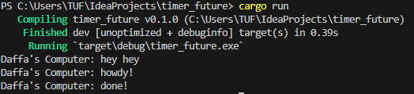
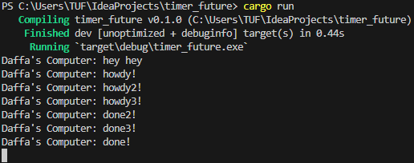

# Module 10 - Asynchronous Programming - Timer

> ##### Muhammad Daffa Grahito Triharsanto - 2206820075 - Pemrograman Lanjut B

## 1.2. Understanding how it works.

Berdasarkan gambar tersebut terlihat bahwa print statement "hey hey" lebih dulu daripada "howdy!" dan "done!". Print statement hey hey tidak berada di dalam asynchronous tasknya melainkan di main thread. Jadi, sampai executor nya memanggil function `run()` maka `spawner.spawn(async {...});` belum akan meng-*execute* tasknya itu.

## 1.3. Multiple Spawn and removing drop

Berdasarkan output di gambar, terlihat kalau programnya tidak stop. Ini terjadi karena drop functionnya tidak dieksekusi, sehingga tidak ada penanda ke executor bahwa tidak ada task lagi yang akan ditambahkan ke queue. Lalu, terlihat juga kalau order dari tasknya tidak teratur tergantung dari scheduling algorithm executor nya. Mungkin saja dieksekusinya in order tapi print messagesnya tidak selalu di print secara teratur. Karena setiap task yang dibikin spawner itu menggunakan resource juga, apabila dibikin sangat banyak pastinya programnya akan berjalan lebih lama serta juga bagaimana executornya akan kesulitan me-*manage* banyak task.